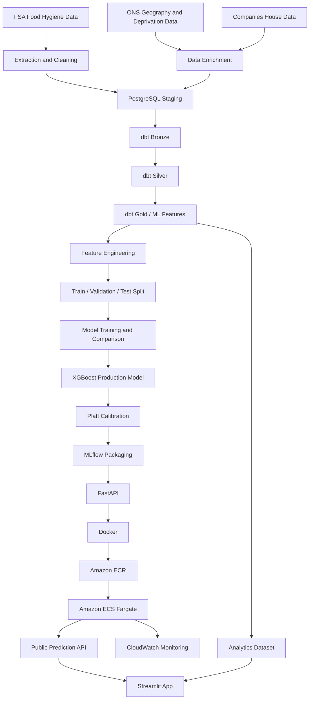

# UK Food Hygiene ML

End-to-end machine learning system for predicting which UK food businesses are at risk of receiving a low food hygiene rating using public UK data.

## Live Demo

**Public app:** https://uk-food-hygiene-ml.streamlit.app

The deployed application includes:

- **Predict Risk** - enter a business type and postcode to receive a model-generated risk prediction
- **Hygiene Analytics** - explore national, regional, local authority, and business category patterns
- **Model Performance** - inspect the production model, validation metrics, threshold choice, and deployment configuration

> This is a portfolio and research project. It is not an official Food Standards Agency rating or enforcement tool.

---

## Project Overview

The main research question is:

> **Can public UK data help predict which food businesses are at risk of getting a low hygiene rating?**

Supporting questions:

1. Which types of food businesses get lower hygiene ratings most often?
2. Do some areas have more low-rated businesses than others?
3. Does local area information help predict risk?
4. Does Companies House information improve prediction?
5. Which factors have the biggest effect on the model's prediction?

The project was designed as a full data and machine learning lifecycle rather than only a notebook-based modelling exercise.

It covers:

- Public API and bulk-data ingestion
- Data profiling and cleaning
- PostgreSQL staging
- dbt transformations
- Statistical analysis and EDA
- Feature engineering
- Chronological train, validation, and test splitting
- Multiple machine learning model families
- Hyperparameter tuning
- Probability calibration
- SHAP explainability
- MLflow model packaging
- FastAPI serving
- Docker containerisation
- Amazon ECR and ECS Fargate deployment
- CloudWatch monitoring
- Streamlit frontend deployment
- Public recruiter-facing demo

---

## System Architecture



---

## Data Sources

### Food Standards Agency

Food hygiene establishment and rating data form the core dataset.

Examples of fields used include:

- Business type
- Local authority
- Rating value
- Rating date
- Hygiene score
- Structural score
- Confidence in management
- Latitude and longitude

### Office for National Statistics and Deprivation Data

Geographic and area-level features were enriched using public UK datasets including:

- National Statistics Postcode Lookup
- English Index of Multiple Deprivation
- Welsh Index of Multiple Deprivation
- Northern Ireland deprivation data
- Geographic area codes
- Region and local authority mappings

### Companies House

Selected company-level information was used to test whether business registration information improved predictive performance.

---

## Final ML Dataset

The final modelling cohort contained:

| Dataset | Rows |
|---|---:|
| Full ML cohort | 348,266 |
| Training | 199,339 |
| Validation | 84,455 |
| Test | 64,472 |

The project used a **chronological split** rather than a random-only split so that evaluation more closely reflected predicting future ratings from earlier information.

Feature sets:

| Feature Set | Encoded Features |
|---|---:|
| CORE | 401 |
| EXTENDED | 495 |

The EXTENDED feature set included additional Companies House information.

Preprocessing was fitted on the training data only to reduce leakage risk.

---

## Target Definition

The binary target is:

```text
target_low_hygiene
```

For the project:

```text
Rating 0, 1, or 2  -> Low hygiene class
Rating 3, 4, or 5  -> Not low hygiene class
```

The positive class is relatively rare, so model evaluation focuses on metrics that are more informative than raw accuracy.

---

## Models Evaluated

The project compared multiple approaches, including:

- Baseline classifiers
- Logistic Regression
- Weighted Logistic Regression
- Random Forest
- Extra Trees
- Gradient boosting methods
- XGBoost
- LightGBM
- Calibrated classifiers

Class imbalance was explicitly considered during modelling.

A naive high-accuracy classifier could predict almost every establishment as the majority class while failing to identify low-rated businesses, so accuracy alone was not treated as the main selection metric.

---

## Production Model

| Component | Production Choice |
|---|---|
| Classifier | Tuned XGBoost |
| Calibration | Platt scaling |
| Decision threshold | 0.07 |
| Serving layer | FastAPI |
| Containerisation | Docker |
| Cloud deployment | Amazon ECS Fargate |
| Container registry | Amazon ECR |
| Model packaging | MLflow |
| Frontend | Streamlit |
| Monitoring | Amazon CloudWatch |

Model and threshold decisions were locked before final test evaluation to reduce the risk of tuning decisions against the final holdout set.

---

## Validation Performance

| Metric | Score |
|---|---:|
| PR-AUC | 0.185 |
| ROC-AUC | 0.773 |
| Precision | 0.146 |
| Recall | 0.539 |
| F1 | 0.230 |
| F2 | 0.351 |

### Why Recall Matters

The project is designed as a **risk screening system**.

Missing a genuinely low-rated business can be more costly than flagging a business that later receives an acceptable rating, so the selected operating point places more emphasis on recall than a standard balanced classification threshold would.

---

## Explainability

SHAP was used during model analysis to understand which features contributed most strongly to predictions.

The explainability stage was used to investigate:

- Which business characteristics are associated with higher predicted risk
- How local deprivation information contributes
- Which geographic features influence predictions
- Whether Companies House enrichment materially affects the model

Explainability is treated as model interpretation rather than proof of causality.

---

## Data Engineering Pipeline

```text
Raw public data
      |
      v
PostgreSQL staging
      |
      v
dbt Bronze
      |
      v
dbt Silver
      |
      v
dbt Gold
      |
      v
ML-ready feature dataset
```

### Bronze
Raw source-aligned staging models.

### Silver
Cleaned and standardised representations with consistent typing and common data quality rules.

### Gold
Final analysis and machine-learning-ready features.

---

## Workflow Orchestration

Apache Airflow is used to coordinate ingestion and loading workflows.

The project includes automated data movement between:

- Public data sources
- Amazon S3
- PostgreSQL / RDS
- Downstream transformation steps

---

## AWS Deployment

The production prediction API was deployed using AWS.

```text
Docker image
    |
    v
Amazon ECR
    |
    v
Amazon ECS Fargate
    |
    v
FastAPI service
    |
    v
XGBoost prediction
```

The ECS service was configured with container health checks so unhealthy tasks can be detected and replaced.

CloudWatch was used to inspect:

- CPU utilisation
- Memory utilisation
- Application logs
- Health requests
- Prediction requests

CloudWatch alarms were also created for elevated CPU and memory usage.

---

## Streamlit Application

The public frontend is available at:

**https://uk-food-hygiene-ml.streamlit.app**

### Predict Risk

The user provides:

- Business type
- UK postcode

The application resolves postcode geography and submits the appropriate features to the deployed API.

The API returns:

- Raw probability
- Calibrated probability
- Binary prediction
- Risk label

### Hygiene Analytics

The analytics dashboard includes:

- UK rating distribution
- Low-rating prevalence
- Regional comparisons
- Local authority comparisons
- Business category analysis
- Interactive filters
- Local authority explorer
- Regional explorer

The deployed analytics dataset is a compressed application-specific extract rather than the full raw FSA file.

This reduced the deployment file from roughly 138 MB to less than 1 MB while preserving the columns required by the dashboard.

### Model Performance

The technical dashboard presents:

- Production model configuration
- Probability calibration method
- Decision threshold
- PR-AUC
- ROC-AUC
- Precision
- Recall
- F1
- F2
- Precision versus recall trade-off
- Production architecture

---

## Repository Structure

```text
uk-food-hygiene-ml/
|
|-- data/
|   |-- app/
|   |   `-- fsa_analytics.csv.gz
|   |-- processed/
|   `-- raw/
|
|-- models/
|   |-- deploy/
|   `-- preprocessors/
|
|-- notebooks/
|
|-- src/
|   |-- pages/
|   |   |-- 1_Predict_Risk.py
|   |   |-- 2_Hygiene_Analytics.py
|   |   `-- 3_Model_Performance.py
|   |
|   |-- api.py
|   |-- streamlit_app.py
|   |-- register_stage16_model.py
|   |-- build_ml_datasets.py
|   `-- data loading scripts
|
|-- tests/
|
|-- Dockerfile
|-- requirements-api.txt
|-- requirements.txt
|-- ecs-task-definition.json
|-- ecs-tasks-trust-policy.json
`-- README.md
```

---

## Project Stages

| Stage | Description | Status |
|---|---|---|
| 1 | Project Setup | Complete |
| 2 | FSA API Extraction | Complete |
| 3 | Profiling and Cleaning Methodology | Complete |
| 4 | PostgreSQL Staging | Complete |
| 5 | dbt Bronze to Silver | Complete |
| 6 | EDA, Statistics and Plotting | Complete |
| 7 | Feature Engineering and Gold Layer | Complete |
| 8 | Baseline ML | Complete |
| 9 | Evaluation, Tuning and SHAP | Complete |
| 10 | Scale FSA Data | Complete |
| 11 | Cloud Architecture | Complete |
| 12 | Airflow | Complete |
| 13 | ONS and Companies House Enrichment | Complete |
| 14 | Final ML Cohort and Feature Preparation | Complete |
| 15 | Model Training and Comparison | Complete |
| 16 | Production Deployment, Monitoring and Final Validation | Complete |

---

## Running the Streamlit App Locally

```bash
pip install -r src/requirements.txt
streamlit run src/streamlit_app.py
```

If port 8501 is already in use:

```bash
streamlit run src/streamlit_app.py --server.port 8505
```

---

## Running the FastAPI Service Locally

```bash
pip install -r requirements-api.txt
uvicorn src.api:app --host 0.0.0.0 --port 8000
```

Health endpoint:

```text
GET /health
```

Interactive API documentation:

```text
http://localhost:8000/docs
```

---

## Docker

Build:

```bash
docker build -t uk-food-hygiene-api .
```

Run:

```bash
docker run -p 8000:8000 uk-food-hygiene-api
```

Test:

```bash
curl http://127.0.0.1:8000/health
```

---

## Example Prediction Flow

```text
User enters business type + postcode
              |
              v
Streamlit frontend
              |
              v
Postcode geocoding
              |
              v
FastAPI request
              |
              v
Feature preprocessing
              |
              v
Tuned XGBoost
              |
              v
Platt calibration
              |
              v
Decision threshold
              |
              v
Risk prediction returned to user
```

---

## Monitoring

The deployed ECS service is monitored through Amazon CloudWatch.

Monitoring includes:

- Container CPU
- Container memory
- Health-check requests
- Prediction requests
- Application logs
- Resource alarms

---

## Key Engineering Decisions

### Chronological splitting
A chronological split was used to make validation more realistic for future-facing prediction.

### Training-only preprocessing
Encoders and transformations were fitted using training data only.

### Calibration
Platt scaling was used because raw model probabilities are not necessarily well calibrated.

### Threshold tuning
The production threshold was selected separately from the default 0.50 threshold because the project objective prioritises identifying more low-rated businesses.

### Separate deployment dataset
The analytics interface does not need the complete 138 MB raw FSA file. A compressed extract with only the required analytics columns is deployed instead.

### API and UI separation
The model is served through FastAPI rather than being loaded directly inside Streamlit. This separates frontend presentation from model serving.

---

## Limitations

This project should not be interpreted as an official inspection or enforcement system.

Important limitations include:

- Predictions are probabilistic and can be wrong
- Public data may contain missing or outdated information
- Low ratings are relatively rare
- Geography can correlate with socioeconomic conditions without implying causation
- Companies House matching may be incomplete
- Historical patterns may change over time
- The deployed API is designed for portfolio demonstration rather than enterprise-scale availability
- Model outputs should support investigation, not automatically determine regulatory action

---

## Future Improvements

Potential extensions include:

- Stable HTTPS API endpoint behind a load balancer
- Custom domain
- Automated CI/CD deployment
- Scheduled retraining
- Data drift monitoring
- Model drift monitoring
- Prediction feedback loop
- Feature store
- Automated data quality alerts
- Expanded Scottish rating-scheme handling
- More advanced Companies House entity matching
- Formal fairness and geographic bias analysis

---

## Technology Stack

### Languages
- Python
- SQL

### Data Engineering
- PostgreSQL
- dbt
- Apache Airflow
- Pandas

### Machine Learning
- scikit-learn
- XGBoost
- LightGBM
- SHAP
- MLflow

### API and Frontend
- FastAPI
- Uvicorn
- Streamlit
- Altair

### Cloud and DevOps
- AWS S3
- AWS RDS
- AWS ECR
- AWS ECS Fargate
- AWS CloudWatch
- Docker
- Docker Compose
- Git
- GitHub

---

## Skills Demonstrated

- End-to-end machine learning
- Data engineering
- Public API ingestion
- SQL
- Data modelling
- dbt
- Workflow orchestration
- Feature engineering
- Imbalanced classification
- Model evaluation
- Hyperparameter tuning
- Probability calibration
- Explainable AI
- REST API development
- Docker
- AWS
- Model deployment
- Monitoring
- Interactive analytics
- Production-oriented system design

---

## Live Project

**Application:**  
https://uk-food-hygiene-ml.streamlit.app

**GitHub Repository:**  
https://github.com/shahmir2021/uk-food-hygiene-ml

---

## Author

**Shahmir Ayub**

Built as an end-to-end machine learning, data engineering, and cloud deployment portfolio project focused on UK food hygiene risk prediction.
